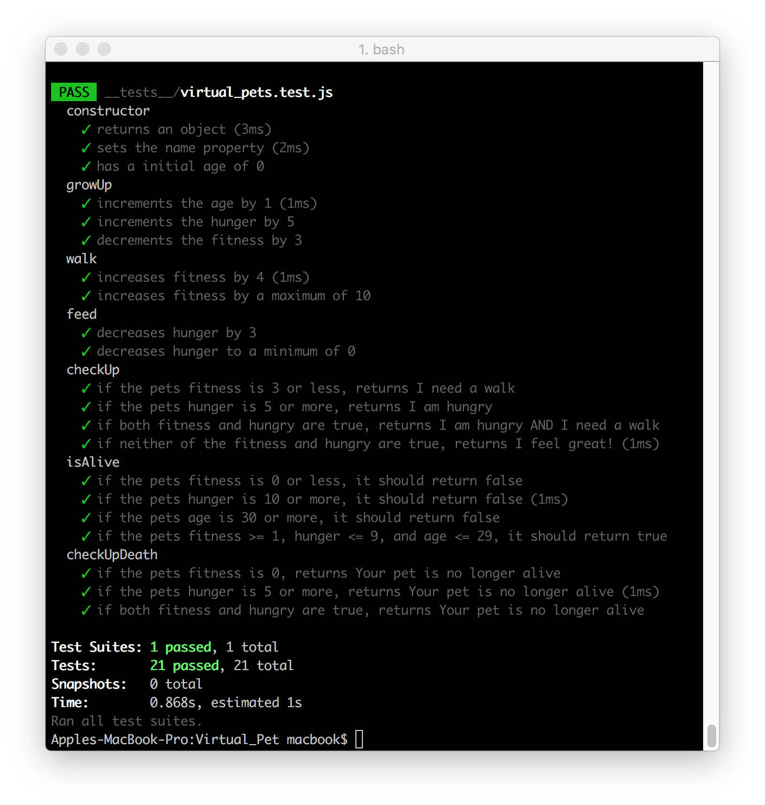

# Virtual Pet :hatching_chick: :hatched_chick: :baby_chick: :chicken: :skull:
Real pets are great, but they do have drawbacks. They smell. Your mum might be allergic to them. Maybe you just aren't allowed one in your flat.

To solve these problems, we're going to make our own **JavaScript pets**.

JavaScript pets are great. Because they're made of JavaScript, they can do literally anything, and they don't have any of the drawbacks of regular pets. They don't even :poop: (unless you program them too, you weirdo).

Building your own **virtual pet**. You'll be able to give it a name, feed it, take it for walks. It's going to be great.

### Built With :mouse:
* [npm](https://www.npmjs.com/) - Node Package Manager
* [Jest](https://facebook.github.io/jest/) - JavaScript Testing Framework

